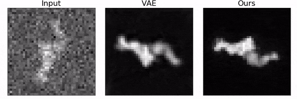

# Deep Learning Medical Imaging Project: Tel-Aviv Universty

Learning to seperate pose and staracture using GAN.




## Setup

This is python3.6 and Pytorch based code. Dependencies:

```bash
# Using conda. If package installation fails it install with pip.
conda install --yes pip
conda config --add channels anaconda
conda config --add channels conda-forge
conda config --add channels pytorch
while read requirement; do conda install --yes $requirement || pip install $requirement; done < requirements.txt 
 
# Using pip
pip install -r requirements.txt 
```

## Datasets

Datasets as tarballs are available from the links below.

- [5HDB simulated EM images](http://bergerlab-downloads.csail.mit.edu/spatial-vae/5HDB.tar.gz)

Download and extract. Working directory stracture:

```
.
├── LICENSE
├── README.md
├── configs
│   └── vae_mnist.yaml
├── data
│   └── 5HDB
│   └── MNIST
├── externals
│   └── spatial_vae
├── models
├── output
├── requirements.txt
└── src
```


## Usage

Training spatial-VAE model:

```bash
cd src
python main_train_vae.py --config_path=../configs/vae_mnist.yaml
python main_train_vae.py --config_path=../configs/vae_5hdb.yaml
```

configuration file is located here: ''configs/vae_mnist.yaml"


Training our approach

```bash
cd src
python main_train_ours.py --config_path=../configs/ours_mnist.yaml 
python main_train_ours.py --config_path=../configs/ours_5hdb.yaml
```

configuration file is located here: ''configs/ours_mnist.yaml"


Pretrained models:

https://drive.google.com/file/d/1HoFbyV8I8AwBNFtlURWzrwdzk1__Asmx/view?usp=sharing


# Ablation experiments

The most basic method

```bash
python main_train_ours.py --config_path=../configs/ours_5hdb.yaml architecture=fc use_wasserstein=false 
```

Using DCGAN

```bash
python main_train_ours.py --config_path=../configs/ours_5hdb.yaml architecture=cnn use_wasserstein=false 
```

DCGAN + Wasserstein

```bash
python main_train_ours.py --config_path=../configs/ours_5hdb.yaml architecture=cnn use_wasserstein=true 
```


## License

This source code is provided under the [MIT License](https://github.com/tbepler/spatial-VAE/blob/master/LICENSE).

